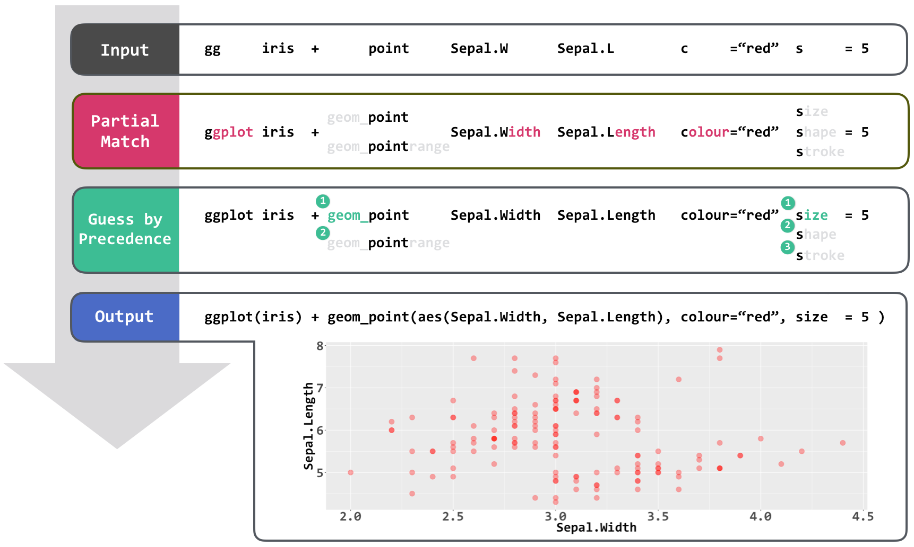
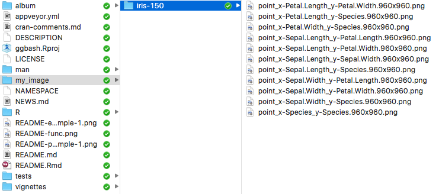

---
output:
  md_document:
    variant: markdown_github
---

<!-- README.md is generated from README.Rmd. Please edit that file -->

```{r, echo = FALSE}
knitr::opts_chunk$set(
  collapse = TRUE,
  comment = "#>",
  fig.path = "README-"
)
```

# ggbash

[](https://travis-ci.org/caprice-j/ggbash)
[](https://ci.appveyor.com/project/caprice-j/ggbash)
[](https://codecov.io/gh/caprice-j/ggbash)

<!-- [](https://coveralls.io/github/caprice-j/ggbash) -->
[](https://codeclimate.com/github/caprice-j/ggbash/issues)
[](http://www.repostatus.org/#wip)

ggbash provides a simpler [ggplot2](https://github.com/tidyverse/ggplot2) syntax.
It features partial match, error messages, and builtin commands such as `copy` or `png`.

The goal of ggbash is to make ggplot2 more comfortable to write for every user,
from beginners to professionals.

```{r, echo=FALSE}
library(ggplot2)
```

## Usage

### One-liner

```{r, eval=FALSE}
ggbash(gg(iris) + point(Sepal.W, Sepal.L, col=Spec, sz=5) + theme(legend.txt(sz=20, face="bold")) | echo)
```

```{r example, echo=FALSE}
ggplot(iris)+geom_point(aes(Sepal.Width,Sepal.Length,colour=Species),size=5)+theme(legend.text=element_text(size=20,face="bold"))
# gg iris + point Sepal.W Sepal.L col=Spec siz=Petal.W + theme text: size=20 face="bold"
```


```{r, eval = FALSE}
# The output of the above ggbash 'echo' command
ggplot(iris) +
geom_point(aes(Sepal.Width, Sepal.Length, colour = Species), size = 5) +
theme(legend.text = element_text(size = 20, face = "bold"))
```


### Interactive

ggbash also provides a bash-like REPL environment
(ggbash environment, or ggbash session).

```{bash, eval=FALSE}
library(ggbash)
ggbash() # start a ggbash session
```

One advantage of ggbash session is that parentheses and commas become optional.

```{bash, eval=FALSE}
gg iris + point Sepal.W Sepal.L col=Spec size=7 + theme lgnd.txt size=20 face="bold" | echo
```

<!-- If you prefer much less typing, -->
If you prefer an extremely short code,

```{r, eval=FALSE}
g iris + p Sepal.W Sepal.L c=Sp s=7 + theme l.tx s=20 f="bold"
```

will produce exactly the same plot, at the sacrifice of readability for beginners.

### theme2()

`ggbash::theme2()` provides the same function of `ggplot2::theme()` by a simpler interface.

```r
p <- ggplot(mtcars) + geom_point(aes(mpg, wt)) 

p + theme(axis.text = element_text(size=20, face="bold"),
          axis.line = element_line(color = "black"))
```

can be written as

```r
p + theme2(axis.text(size=20, face="bold"), axis.line(color="black"))

# or much shorter
p + theme2(a.txt(sz=20, f="bold"), a.line(c="black"))
```


## Features



### 1. Partial Match

Even if the unique identification of specified elements
(geoms, aesthetics, column names, theme element names, etc.)
is not possible,
`ggbash` anyway tries to execute its best guess
instead of bluntly returning an error.

For the above ggbash input `gg iris + point Sepal.W Sepal.L c="red" sz=5`,
ggbash performs partial matches six times.

* __ggplot function__
    + `gg` matches `ggplot2::ggplot()`.
        + You can also write `ggplot` or `g`.

* __geom names__
    + `point` matches `geom_point`.
        + You can also write `geom_point` (i.e. write `geom_` prefix explicitly).

* __column names__
    + `Sepal.W` matches `iris$Sepal.Width`.
  
    + `Sepal.L` matches `iris$Sepal.Length`.
  
* __aesthetics names__
    + `c` matches `colour`, which is the aesthetic of `geom_point`.
    + `sz` matches `size` among `size`, `shape`, and `stroke` 
       by [fuzzy match](https://en.wikipedia.org/wiki/Approximate_string_matching).
    
<!-- * __theme element name__ -->

Any of the following commands return exactly the same plot.

```{r, eval=FALSE}
ggplot(iris)+geom_point(aes(x=Sepal.Width,y=Sepal.Length),colour="red",size=5)  # 78 characters
ggplot iris +geom_point     x=Sepal.Width y=Sepal.Length  colour="red" size=5
ggplot iris +     point       Sepal.Width   Sepal.Length  colour="red" size=5
gg     iris +     point       Sepal.W       Sepal.L       col   ="red" siz =5
gg     iris +     p           Sepal.W       Sepal.L       c     ="red" sz  =5
g      iris +     p           Sepal.W       Sepal.L       c     ="red" s   =5   # 38 characters
```
    
Users can select one of the styles which fits them best.    
    
### 2. Fixit (Error Diagnostics)

```{r, eval=FALSE}
ggbash(gg(diamonds, x=caret, y=price) + point + smooth)  # typo

COMPILE ERROR: No such column names

  The column name "caret" does not exist.
    maybe: carat, clarity

The built ggplot2 object is :
  ggplot(diamonds, aes( <<INVALID_TOKEN_HERE>> ) + geom_point() + geom_smooth()

```

ggbash has a compiler (ggbash compiler) which converts given ggbash "source code" into an "executable" ggplot2 object. During the compiling process, ggbash can detect various human errors such as element misspecifications (column names, aes names, theme element names, ...). Beginners can learn why their codes don't work from the generated diagnostics.

```{r, eval=FALSE}
ggbash(gg(diamonds, x=carat, y=price) + point + smooth) # without typo
```

```{r pipe_example, echo=FALSE}
ggplot(mtcars) + geom_point(aes(x=mpg, y=wt)) + geom_smooth(aes(x=mpg, y=wt), method='loess')
```


### 3. Builtin ggbash Commands 

#### `echo`

Print the built ggplot2 object as a string.
Useful for learning ggplot2 original grammar iteratively.

```{bash, eval=FALSE}
gg iris + point Sepal.W Sepal.L size=7 + theme lgnd.txt face="bold" | echo
```


```{r, eval = FALSE}
# The output of ggbash 'echo' command
ggplot(iris) +
geom_point(aes(Sepal.Width, Sepal.Length), size = 7) +
theme(legend.text = element_text(face = "bold"))
```


#### `copy`

```{r, eval=FALSE}
ggbash(gg(iris) + p(Sepal.W, Sepal.L, col=Sp, siz=4) | copy)
    copied to clipboard:
    ggplot(iris) + geom_point(aes(x=Sepal.Length,
                                  y=Sepal.Width,
                                  colour=Species,
                                  size=Petal.Width))
```

#### `png` and `pdf`


```{r, eval=FALSE}
ggbash(gg(iris) + p(Sepal.W, Sepal.L, col=Sp) | png(my_image))
    saved in:
    'currentDir/my_image/iris-150/x-Sepal.Width_y-Sepal.Length-colour-Species.960x960.png'
```

If you would like to get a scatterplot matrix,
```{r, eval=FALSE}
for( i in 1:ncol(iris) )
    for ( j in min(i+1, ncol(iris)):ncol(iris) )
        ggbash(paste("gg iris + point ",
                     colnames(iris)[i],
                     colnames(iris)[j],
                     " | png my_image"))
```



##### Order Agnostic Arguments

<!-- `png` and `pdf` could receive plot size, file name, and directory name to save plots.
If not specified, the default values are used. -->

`png` and `pdf` arguments are order-agnostic: Any of the following notations
generates the same png file `"my_image/iris-150/point-my-plot.1960x1480.png"`.

```{bash, eval=FALSE}
gg mtcars | p mpg cyl | png  "my-plot"  1960*1480  my_image 
gg mtcars | p mpg cyl | png  "my-plot"  my_image   1960*1480
gg mtcars | p mpg cyl | png  my_image   1960*1480  "my-plot"
gg mtcars | p mpg cyl | png  my_image   "my-plot"  1960*1480 
gg mtcars | p mpg cyl | png  1960*1480  "my-plot"  my_image 
gg mtcars | p mpg cyl | png  1960*1480  my_image   "my-plot"

# ... or in R's normal session
ggbash(gg(mtcars) + p(mpg,cyl) | png(1960*1480, my_image, "my_plot"))
```

`png` and `pdf` commands interpret a single- or double-quoted token as file name
(`"my-plot"` in the following example), a token with `*` infix as plot size,
and otherwise directory name.


##### Guessing Inches or Pixels

<!-- 1 inch == 2.54 cm -->

<!-- While the `pdf` function in R only recognizes width and height as inches, -->
The `pdf` command in ggbash recognizes both inches and pixels.

**If the given `width` or `height` in `(width)x(height)` is less than 50**
(the same limit of `ggplot2::ggsave`)
**, the numbers are interpreted as inches (1 inch = 2.54 cm).**

```{bash, eval=FALSE}

# pdf of 15 inch width (=~ 40 cm) and 9 inch height (=~ 23 cm)
gg iris + p Sepal.W Sepal.L | pdf 16*9

# pdf of 1440 pixel (=~ 50 cm) width and height
gg iris + p Sepal.W Sepal.L | pdf 1440*1440

# the png command in ggbash also recognises inches and pixels
gg iris + p Sepal.W Sepal.L | png 16*9

```

Note: the default dpi (dots per inch) in ggbash is
72 (R's default) and cannot be changed.
If you would like to change the dpi,
you could consider `ggplot2::ggsave(..., dpi=...)`.

##### Auto-generated Filenames

<!-- The `png` and `pdf` functions in R save a plot in `Rplot001.{png|pdf}` if no file name is specified.
That function can easily overwrite the previous plot,
and users often have to set file names manually.

The `png` and `pdf` commands in `ggbash` tries to generate
a sensible file name based on the given dataset and
aesthetic names if no file name is specified. -->

With `iris` dataset which has 150 rows,
the plot of `gg iris + p Sepal.W Sepal.L | png` is saved
in `iris-150/point_x-Sepal.Width_y-Sepal.Length.960x960.png`.

If you happen to have another `iris` dataset
which has a different number of rows (say 33),
the same command result is saved in `iris-33/` directory.


<!-- Scales are ... -->
<!-- Facets are ... -->
<!-- for is by pdf extension and i values -->
<!-- Themes are abstracted away and not encoded in file names. -->

## Installation
```{r, eval=FALSE}
# install.packages("devtools")
devtools::install_github("caprice-j/ggbash")
```

+ If you get `no appender.console()` error,
you might need `install.packages('rly')`.
`packageVersion('rly')` should be at least 1.4.2.

+ This package is still in its infancy, and might contain several installation bugs.

#### Note
Currently, I am in my school semester and suspending ggbash development.
Please wait till May 2017 :)

## Goals

The goal of ggbash is to make ggplot2 more comfortable to write.
It can be categorized into two subgoals:

1. **Better EDA experience.**
Provide blazingly fast way to do exploratory data anslysis.

    + less typing by Partial Match.

    + casually save plots with Pipe Operators and Auto-generated Filenames.

2. **Intuitive finalization (to be implemented).**
Make it more intuitive to finalize your plots.

    + adjust colours or lineweights

    + rotate axis labels

    + decide tick label intervals and limits

<!--    + generate line-wrapped titles or legends -->

## Learning ggbash

`ggbash` follows original ggplot2 syntax
as much as possible for reducing learning costs of current ggplot2 users.

Learning ggplot2 might be the best way to understand ggbash syntax.
The [document](http://docs.ggplot2.org/current/) and
[book](https://github.com/hadley/ggplot2-book) of ggplot2 
would be helpful.

The [vignette](https://github.com/caprice-j/ggbash/blob/master/vignettes/Introduction-to-ggbash.Rmd)
of ggbash is still in a draft.

## Other Works

As far as I know, there are no previous attempts to implement
a higher-level language that
[transcompiles](https://en.wikipedia.org/wiki/Source-to-source_compiler) to ggplot2.
Reports of similar attempts are welcomed.

<!--

About a different way to generate scatterplot matrix,
`GGally::ggpairs` does the similar work. The major differences are:

+ `GGally::ggpairs` output the scatterplot matrix in one plot,
  while `ggbash` outputs each subplot as a plot (or as a file).
+ `GGally::ggpairs` uses `ggplot2::ggsave` to save a plot with no default filename,
  while `ggbash` uses `| png ` or `| pdf` pipe chains with auto-generated filenames.

-->

`ggbash` draws inspiration from some other higher level programming
languages including Bash, CoffeeScript, Ruby, and Lisp.
Fixit is inspired by [Fix-It Hints](http://clang.llvm.org/docs/InternalsManual.html#fix-it-hints) in clang C++ compiler.

## Limitations

ggbash has some weird specification due to parsing rule constraints:

#### One-liner

#### Interactive


## Current Implementation Status

ggbash is first released on December 29, 2016.

+ DONE:
    + version 0.1 : ggplot(), aes() elements, non aes() elements, ggsave
    + version 0.2 : theme()
    + version 0.3 : (no ggplot2 functions)
    + version 0.4 : (no ggplot2 functions)

+ TODO:
    + stat_..., scale_..., coord_..., facet_..., labs, position_..., xlim, ylim
    + sprintf()-like formatting for filenames (like `png "my-%aes%-%facet%"`)

+ HOW:
    + auto completion (R's `prompt()` does not have built-in completions)
    <!-- DONE + interfaces to dplyr/tidyr (how to handle dot operator `.`) -->
    + aes/non-aes sorting
    
<!-- ## Usecase: Plot in Terminal and Copy to RStudio -->

<!--  -->
