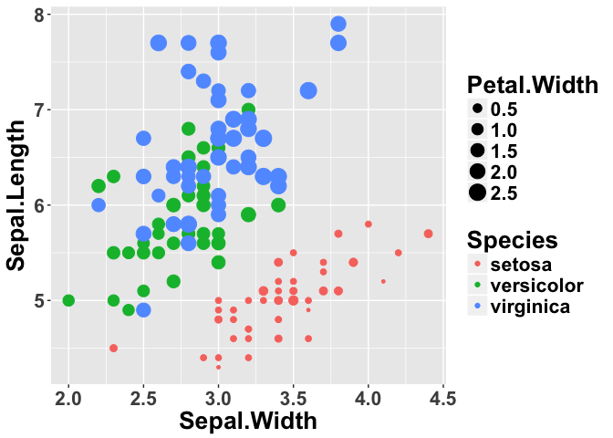
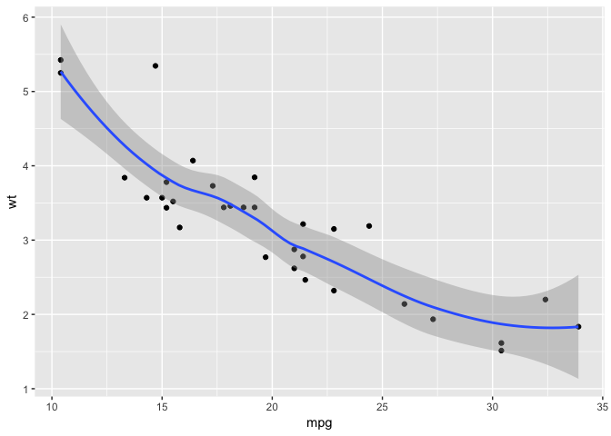

<!-- README.md is generated from README.Rmd. Please edit that file -->
ggbash: A Simpler Syntax for ggplot2
====================================

[](https://travis-ci.org/caprice-j/ggbash) [](https://ci.appveyor.com/project/caprice-j/ggbash) [](https://codecov.io/gh/caprice-j/ggbash)  <!-- [](https://coveralls.io/github/caprice-j/ggbash) --> [](https://codeclimate.com/github/caprice-j/ggbash/issues)

ggbash provides a bash-like REPL environment for [ggplot2](https://github.com/tidyverse/ggplot2).

Usage
-----

### Interactive

``` bash
library(ggbash)
ggbash() # start a ggbash session
```

``` bash
gg iris  +  point Sepal.W Sepal.L col=Spec siz=Petal.W  +  theme text: size=20 face="bold" |  echo
```



``` r
# The output of the above ggbash 'echo' command
ggplot(iris) +
geom_point(aes(Sepal.Width, Sepal.Length,
               colour=Species, size=Petal.Width)) +
theme(text=element_text(size=20, face="bold"))
```

### One-liner

``` r
ggbash('gg iris + point Sepal.W Sepal.L', clipboard=1)
# copied to clipboard: 
#   ggplot(iris) + geom_point(aes(x=Sepal.Width, y=Sepal.Length))

# ... or using the %>% operator
ggbash('gg iris + point Sepal.W Sepal.L') %>% copy_to_clipboard
```

Features
--------


### 1. Partial Prefix Match

For the above input `gg iris + point Sepal.W Sepal.L c="red" s=5`, ggbash performs partial matches six times.

-   **ggplot function**
    -   `gg` matches `ggplot2::ggplot()`.
-   **geom names**
    -   `point` matches `geom_point`.
        -   Note: you can also write `geom_point` (i.e. write `geom_` prefix explicitly).
-   **column names**
    -   `Sepal.W` matches `iris$Sepal.Width`.

    -   `Sepal.L` matches `iris$Sepal.Length`.

-   **aesthetics names**
    -   `c` matches `colour`, which is the aesthetic of `geom_point`.
    -   `s` matches `size` by predefined ggbash Precedence (explained below).

Any of the following commands return exactly the same plot.

``` r
ggplot(iris)+ geom_point(aes(x=Sepal.Width,y=Sepal.Length),colour="red",size=5)  # 79 characters
ggplot iris + geom_point     x=Sepal.Width y=Sepal.Length  colour="red" size=5
ggplot iris +      point       Sepal.Width   Sepal.Length  colour="red" size=5
gg     iris +      point       Sepal.W       Sepal.L       col   ="red" siz =5
gg     iris +      p           Sepal.W       Sepal.L       c     ="red" s   =5
g      iris +      p           Sepal.W       Sepal.L       c     ="red" s   =5   # 38 characters
```

### 2. Precedence

Even if an unique identification is not possible, `ggbash` anyway tries to execute its best guess instead of bluntly returning an error. Everything in `ggbash` is designed to achieve the least possible expected keystrokes.

<!-- https://en.wikipedia.org/wiki/DWIM -->
For example, if the input is `ggplot iris + p Sepal.Width Sepal.Length`, `p` ambiguously matches four different geoms, `geom_point`, `geom_path`, `geom_polygon`, and `geom_pointrange`.
Among these geoms, `ggbash` determines the geom to use according to the above predefined order of precedence (the first one, `geom_point`, is selected in this example).

While it's possible to check and define your own precedence order through `define_ggbash_constant_list()`, adding one or two characters may be faster in most cases.

### 3. Pipe Operators (`+` and `|`)

#### Pipe for Adding Layers (`+`)

``` r
ggbash('gg mtcars x=mpg y=wt + point + smooth')
```



#### Pipe for Copying Results (`|`)

``` r
ggbash('gg iris + p Sepal.W Sepal.L col=Sp siz=4 | copy')
    copied to clipboard:
    ggplot(iris) + geom_point(aes(x=Sepal.Length,
                                  y=Sepal.Width,
                                  colour=Species,
                                  size=Petal.Width))
```

#### Pipe for Saving Results (`|`)

``` r
ggbash('gg iris + p Sepal.W Sepal.L col=Sp | png my_image/')
    saved in:
    'currentDir/my_image/iris-150/x-Sepal.Width_y-Sepal.Length-colour-Species.960x960.png'
```

If you would like to get a scatterplot matrix,

``` r
for( i in 1:ncol(iris) )
    for ( j in min(i+1, ncol(iris)):ncol(iris) )
        ggbash("gg iris + point {colnames(iris)[i]} {colnames(iris)[j]} | png my_image/")
```


### 4. Auto-generated Filenames

<!-- The `png` and `pdf` functions in R save a plot in `Rplot001.{png|pdf}` if no file name is specified.
That function can easily overwrite the previous plot,
and users often have to set file names manually.

The `png` and `pdf` commands in `ggbash` tries to generate
a sensible file name based on the given dataset and
aesthetic names if no file name is specified. -->
With `iris` dataset which has 150 rows, the plot of `gg iris + p Sepal.W Sepal.L | png` is saved in `iris-150/point_x-Sepal.Width_y-Sepal.Length.960x960.png`.

If you happen to have another `iris` dataset which has a different number of rows (say 33), the same command result is saved in `iris-33/` directory.

### 5. Order Agnostic Arguments

<!-- `png` and `pdf` could receive plot size, file name, and directory name to save plots.
If not specified, the default values are used. -->
`png` and `pdf` arguments are order-agnostic: Any of the following notations generates the same png file `"my_image/iris-150/point-my-plot.1960x1480.png"`.

``` bash
gg mtcars | p mpg cyl | png  "my-plot"  1960x1480  my_image/     
gg mtcars | p mpg cyl | png  "my-plot"  my_image/  1960x1480
gg mtcars | p mpg cyl | png  my_image/  1960x1480  "my-plot"
gg mtcars | p mpg cyl | png  my_image/  "my-plot"  1960x1480 
gg mtcars | p mpg cyl | png  1960x1480  "my-plot"  my_image/
gg mtcars | p mpg cyl | png  1960x1480  my_image/  "my-plot"
```

`png` and `pdf` commands interpret a single- or double-quoted token as file name (`"my-plot"` in the following example), a token with `/` suffix as directory name, and otherwise plot size.

#### Guessing Inches or Pixels

<!-- 1 inch == 2.54 cm -->
<!-- While the `pdf` function in R only recognizes width and height as inches, -->
The `pdf` command in ggbash recognizes both inches and pixels.

**If the given `width` or `height` in `(width)x(height)` is less than 50** (the same limit of `ggplot2::ggsave`) **, the numbers are interpreted as inches (1 inch = 2.54 cm).**

``` bash

# pdf of 15 inch width (=~ 40 cm) and 9 inch height (=~ 23 cm)
gg iris + p Sepal.W Sepal.L | pdf 16x9

# pdf of 1440 pixel (=~ 50 cm) width and height
gg iris + p Sepal.W Sepal.L | pdf 1440x1440

# the png command in ggbash also recognises inches and pixels
gg iris + p Sepal.W Sepal.L | png 16x9
```

Note: the default dpi (dots per inch) in ggbash is 72 (R's default) and cannot be changed. If you would like to change the dpi, you could consider `ggplot2::ggsave(..., dpi=...)`.

<!-- ### 6. Type-specific For Loop (To Be Implemented) -->
<!-- ```{r, eval=FALSE} -->
<!-- # to be implemented -->
<!-- > str(iris) -->
<!-- 'data.frame':  150 obs. of  5 variables: -->
<!--  $ Sepal.Length: num  5.1 4.9 4.7 4.6 5 5.4 4.6 5 4.4 4.9 ... -->
<!--  $ Sepal.Width : num  3.5 3 3.2 3.1 3.6 3.9 3.4 3.4 2.9 3.1 ... -->
<!--  $ Petal.Length: num  1.4 1.4 1.3 1.5 1.4 1.7 1.4 1.5 1.4 1.5 ... -->
<!--  $ Petal.Width : num  0.2 0.2 0.2 0.2 0.2 0.4 0.3 0.2 0.2 0.1 ... -->
<!--  $ Species     : Factor w/ 3 levels "setosa","versicolor",..: 1 1 1 1 1 1 1 1 1 1 ... -->
<!-- # a : use all five variables (numeric and factor) -->
<!-- user@host imageDir (iris) $ for a in 2:5 point 1 a | pdf -->
<!-- saved as 'iris-150/x-Sepal.Width_y-fora.pdf' (960 x 960) -->
<!-- # a : for loop on four numeric (integer) variables -->
<!-- user@host imageDir (iris) $ for i in 2:5 point 1 i | pdf -->
<!-- saved as 'iris-150/x-Sepal.Width_y-fori.pdf' (960 x 960) -->
<!-- ``` -->
<!-- You might have met `non-numeric argument to 'pairs()'` error. -->
<!-- When you try to generate tens or hundreds of plots, usually -->
<!-- a type-specific error occurs and users are required to subset -->
<!-- dataset columns by types. -->
<!-- In `ggbash`, the for-loop variable expresses its type as follows: -->
<!-- +  `for a in 1:5` : **A**ll five variables will be iterated. -->
<!-- +  `for c in 1:5` : **C**haracter variables among five columns will be iterated. -->
<!-- +  `for f in 1:5` : **F**actor variables among five columns will be iterated. -->
<!-- +  `for i in 1:5` : **I**nteger variables among five columns will be iterated. -->
<!-- +  `for n in 1:5` : **N**umeric variables among five columns will be iterated. -->
<!-- (Note: boolean variables will also be iterated in `i` and `n` cases.) -->
<!-- #### TODO how can we encode scales/facets/themes differences? -->
<!-- Scales are ... -->
<!-- Facets are ... -->
<!-- for is by pdf extension and i values -->
<!-- Themes are abstracted away and not encoded in file names. -->
Installation
------------

``` r
# install.packages("devtools")
devtools::install_github("jimhester/fstrings")
devtools::install_github("caprice-j/ggbash")
```

-   ggbash depends on [fstrings](https://github.com/jimhester/fstrings) package, which is not on CRAN as of January 3, 2017.

-   If you get `no appender.console()` error, you might need `install.packages('futile.logger'); library('futile.logger')`.

-   This package is in its very early stage, and might have a lot of installation bugs.

Goals
-----

The goal of ggbash is to make ggplot2 more comfortable to write. It can be categorized into two subgoals:

1.  **Better EDA experience.** Provide blazingly fast way to do exploratory data anslysis.

    -   less typing by Partial Prefix Match and Precedence.

    -   casualy save plots with Pipe Operators and Auto-generated Filenames.

2.  **Intuitive finalization (to be implemented).** Make it more intuitive to finalize your plots.

    -   adjust colours or lineweights

    -   rotate axis labels

    -   decide tick label intervals and limits

    -   generate line-wrapped titles or legends

Learning ggbash
---------------

`ggbash` follows ggplot2 notations as much as possible for reducing learning costs of current ggplot2 users.

Learning ggplot2 might be the best way to understand ggbash notations. The [document](http://docs.ggplot2.org/current/) and [book](https://github.com/hadley/ggplot2-book) of ggplot2 would be helpful.

The [vignette](https://github.com/caprice-j/ggbash/blob/master/vignettes/Introduction-to-ggbash.Rmd) of ggbash is still in a draft.

Other Works
-----------

As far as I know, there are no previous attempts to implement a higher-level language that [transcompiles](https://en.wikipedia.org/wiki/Source-to-source_compiler) to ggplot2. Reports of similar attempts are welcomed.

<!--

About a different way to generate scatterplot matrix,
`GGally::ggpairs` does the similar work. The major differences are:

+ `GGally::ggpairs` output the scatterplot matrix in one plot,
  while `ggbash` outputs each subplot as a plot (or as a file).
+ `GGally::ggpairs` uses `ggplot2::ggsave` to save a plot with no default filename,
  while `ggbash` uses `| png ` or `| pdf` pipe chains with auto-generated filenames.

-->
ggbash is influenced by some other higher level programming languages such as CoffeeScript or Ruby.

Current Implementation Status
-----------------------------

-   DONE:
    -   version 0.1 : ggplot(), aes() elements, non aes() elements, ggsave
    -   version 0.2 : theme()
-   TODO:
    -   stat\_..., scale\_..., coord\_..., facet\_..., labs, position\_...
    -   sprintf()-like formatting for filenames (like `png "my-%aes%-%facet%"`)
-   HOW:
    -   auto completion (R's `prompt()` does not have built-in completions)
    -   new geoms/stats in ggplot2 extensions
    -   Approximate String Match (e.g. identifying `size` by `sz`)
    -   interfaces to dplyr/tidyr

<!-- ## Usecase: Plot in Terminal and Copy to RStudio -->
<!--  -->
